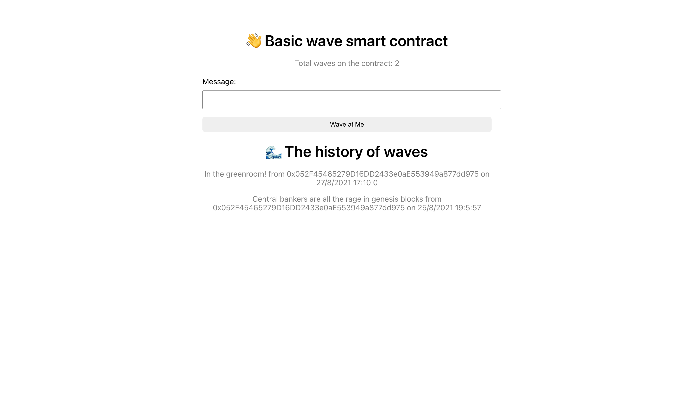

# Solidity Smart Contract for Messaging Blockchain App

A Solidity smart contract that allows you to add messages to the Ethereum blockchain. The smart contract is preloaded with 0.1 Ethereum (Rinkeby testnet) and you have a 50% chance of winning 0.0001 Ethereum when you wave. There is also a 30 second spam filter if you try to use bots to get my fake Ethereum

The smart contract is available on the Ethereum Rinkeby testnet. The contract address is: 0x203eD24eA56606be54cC5449D661b21946C52187 and you can view it at Etherscan [here](https://rinkeby.etherscan.io/address/0x203eD24eA56606be54cC5449D661b21946C52187).

You can play with the smart contract by the following instructions [here](https://timkellytk.github.io/web3-app-solidity-ui/). You can see the repo for the UI [here](https://github.com/timkellytk/web3-app-solidity-ui).

[Play with the smart contract](https://timkellytk.github.io/web3-app-solidity-ui/)

Inspired by a [BuildSpace](https://buildspace.so/) tutorial.
